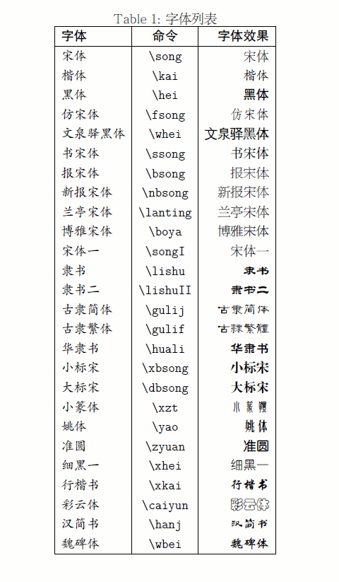

personal resume.

```bash
xelatex main.tex
```

The following is how to make latex support Chinese copied from [linux-wiki.cn](http://linux-wiki.cn/wiki/zh-hans/LaTeX%E4%B8%AD%E6%96%87%E6%8E%92%E7%89%88%EF%BC%88%E4%BD%BF%E7%94%A8XeTeX%EF%BC%89).

## LaTeX中文排版（使用XeTeX）

LaTeX是功能强大的排版工具，在[XeTeX](http://scripts.sil.org/xetex)、[CTeX](http://www.ctex.org/)等软件的努力下，在Linux中使用其排版中文其实很简单。（而XeLaTeX语法与LaTeX相同，还提供了些增强功能，多数LaTeX文档不经修改就能直接用XeLaTeX编译。）本文介绍使用XeTeX在Linux中排版中文的几种简便方法。

## 准备工作

首先要安装好XeTeX软件，比较方便的方法是安装Texlive 2009或以上版本。Ubuntu、Fedora、Archlinux等流行发行版都在软件仓库中包括了Texlive，如在Ubuntu、Fedora中可安装软件包 texlive-xetex ，在Archlinux中建议安装texlive-most。如果发行版未提供Texlive或提供的版本太旧，也可自行到[Texlive](http://www.tug.org/texlive/)网站上下载。（TeX Live在世界各地的镜像很多，选择合适的镜像下载速度会很快的。）

接着要准备字体。这一步是可选的，但Linux中的中文字体多数不太适合用于排版文档，建议复制Windows中的字体或Adobe的字体。注意XeTeX可以直接使用系统中的字体，只要把需要字体复制到指定位置就行，无需自己生成字体文件。比如复制Windows中的宋体、黑体等字体：

```bash
$ sudo mkdir /usr/share/fonts/win
$ sudo cp /media/Win系统盘挂载点/Windows/Fonts/{SIM,sim}* /usr/share/fonts/win/
```

第二行按Windows的版本不同可能有变化，总之只要把那些SIM及sim开头的字体文件拷出来就可以了。

因为复制文件时是以root身份进行的， 复制到目标文件夹下的字体文件其读取的权限设置可能有问题。建议如下设定：

```bash
$ sudo chmod 755 /usr/share/fonts/win/*
```

此外，有些免费的字体可以下载使用，比如楷体, 细明体。 如果是在ubuntu下，可以直接通过以下命令安装微软的公开免费字体：

```bash
$ sudo apt-get install xfonts-wqy ttf-wqy-microhei ttf-wqy-zenhei
```

接着,需要更新字体缓存：

```bash
$ fc-cache
```

为了使整个系统下的用户的字体列缓存都更新，建议使用root权限执行:

```bash
$ sudo fc-cache -f -s -v
```

使用fc-list查看可用的字体：

```bash
$ fc-list
```

或者只查看中文的字体

```bash
$ fc-list ：lang=zh
```

如果能看到想要的中文字体，就可以了。至此，准备工作已经结束。

## 中文排版例解

下面的各个例子，可以通过xelatex命令编译成PDF文件，具体方法如下：

1. 将代码存成UTF-8编码的文本文件，如test.tex
2. 使用xelatex命令编译存好的源码，如xelatex test.tex
3. 使用PDF查看工具看结果

## 使用CTeX排版中文

CTeX大大简化了中文排版过程，只要复制了Windows里的字体，并使用TeX Live 2009及以后的版本，下面的代码就可产生出中文PDF文档。

```latex
\documentclass{ctexart}
\begin{document}
中文宏包测试
\end{document}
```

也可以使用article类和ctex宏包：

```latex
\documentclass{article}
\usepackage{ctex}
\begin{document}
中文宏包测试
\end{document}
```

该方法最为简便，CTeX功能也很强大，提供了不少中文排版实用功能，具体可参阅CTeX的文档。

## 使用xeCJK排版中文

CTeX在XeLaTeX环境下实际是用xeCJK处理中文的，如果不想用CTeX这么复杂的包，也可以使用xeCJK处理中文。

```latex
\documentclass[11pt]{article}
\usepackage[BoldFont,SlantFont,CJKsetspaces,CJKchecksingle]{xeCJK}
\setCJKmainfont[BoldFont=SimHei]{SimSun}
\setCJKmonofont{SimSun}% 设置缺省中文字体
\parindent 2em   %段首缩进
 
\begin{document}
\section{举例}
\begin{verbatim}
标点。
\end{verbatim}
 
汉字Chinese数学$x=y$空格
\end{document}
```

使用xeCJK直接处理中文时，字体的选择较自由些。

## 直接用XeLaTeX排版中文

由于XeLaTeX可以手动设置字体，故可以用这种方法排版中文。该方法设置字体最为灵活，但在处理中英文混排的文件时，必须手动逐处指定每段英文的字体，否则英文也用中文字体显示，不大美观。

如果希望使用该方法，可以参考 http://www.heboliang.cn/archive/xetex-intro.html

## XeTeX：一个新的LaTeX中文排版解决方案

以前使用CJK进行中文的排版，需要自己生成字体库，近日，出现了XeTeX，可以比较好的解决中文字体问题，不需要额外生成LaTeX字体库，直接使用计算机系统里的字体，本文以在Linux下为例说明XeTeX的使用。

操作系统: Ubuntu

TeX：除了texlive包外，还需要安装的包是texlive-xetex。

字体：可以使用fc-list查看你自己的字体库，注意字体的完整名称，在XeTeX里面会用到。

安装好后，开始一个例子，例子里面的字体是我计算机里面的一些字体，源文件必须是UTF8编码，这在Linux很容易。

源文件：xetex.tex

```latex
\documentclass[12pt,a4paper]{article}
\usepackage{fontspec,xunicode,xltxtra}
\usepackage{titlesec}
\usepackage[top=1in,bottom=1in,left=1.25in,right=1.25in]{geometry}

\titleformat{\section}{\Large\xbsong}{\thesection}{1em}{}

\XeTeXlinebreaklocale "zh"
\XeTeXlinebreakskip = 0pt plus 1pt minus 0.1pt

\newfontfamily\song{Simsun (Founder Extended)}
\newfontfamily\bwei{FZBeiWeiKaiShu-S19S}
\newfontfamily\zbhei{FZZhanBiHei-M22T}
\newfontfamily\xzt{FZXiaoZhuanTi-S13T}
\newfontfamily\xbsong{FZXiaoBiaoSong-B05}
\newfontfamily\dbsong{FZDaBiaoSong-B06}
\newfontfamily\gulif{FZGuLi-S12T}
\newfontfamily\gulij{FZGuLi-S12S}
\newfontfamily\kai{FZKai-Z03}
\newfontfamily\hei{FZHei-B01}
\newfontfamily\whei{WenQuanYi Zen Hei}
\newfontfamily\fsong{FZFangSong-Z02}
\newfontfamily\lanting{FZLanTingSong}
\newfontfamily\boya{FZBoYaSong}
\newfontfamily\lishu{FZLiShu-S01}
\newfontfamily\lishuII{FZLiShu II-S06}
\newfontfamily\yao{FZYaoTi-M06}
\newfontfamily\zyuan{FZZhunYuan-M02}
\newfontfamily\xhei{FZXiHei I-Z08}
\newfontfamily\xkai{FZXingKai-S04}
\newfontfamily\ssong{FZShuSong-Z01}
\newfontfamily\bsong{FZBaoSong-Z04}
\newfontfamily\nbsong{FZNew BaoSong-Z12}
\newfontfamily\caiyun{FZCaiYun-M09}
\newfontfamily\hanj{FZHanJian-R-GB}
\newfontfamily\songI{FZSongYi-Z13}
\newfontfamily\hcao{FZHuangCao-S09}
\newfontfamily\wbei{FZWeiBei-S03}
\newfontfamily\huali{FZHuaLi-M14}
\setmainfont{FZLanTingSong}

\renewcommand{\baselinestretch}{1.25}

\begin{document}

\title{\whei XeTeX使用小结}
\author{\fsong 何勃亮}
\date{\kai2009年6月21日}

\maketitle

\section{简介}
以前使用CJK进行中文的排版，需要自己生成字体库，近日，出现了XeTeX，可以比较好的解决中文字体问题，不需要额外
生成LaTeX字体库，直接使用计算机系统里的字体。

\section{字体列表}
本文使用了大量本机自带的字体。


\begin{table}[htbp]
\caption{字体列表}

\centering
\begin{tabular}{|l|c|r|}
\hline
\hei 字体 & \hei 命令 & \hei 字体效果 \\
\hline
\kai 宋体 & \verb+\song+ & \song 宋体 \\
\kai 楷体 & \verb+\kai+ & \kai 楷体 \\
\kai 黑体 & \verb+\hei+ & \hei 黑体 \\
\kai 仿宋体 & \verb+\fsong+ & \fsong 仿宋体 \\
\kai 文泉驿黑体 & \verb+\whei+ & \whei 文泉驿黑体 \\
\kai 书宋体 & \verb+\ssong+ & \ssong 书宋体 \\
\kai 报宋体 & \verb+\bsong+ & \bsong 报宋体 \\
\kai 新报宋体 & \verb+\nbsong+ & \nbsong 新报宋体 \\
\kai 兰亭宋体 & \verb+\lanting+ & \lanting 兰亭宋体 \\
\kai 博雅宋体 & \verb+\boya+ & \boya 博雅宋体 \\
\kai 宋体一 & \verb+\songI+ & \songI 宋体一 \\
\kai 隶书 & \verb+\lishu+ & \lishu 隶书 \\
\kai 隶书二 & \verb+\lishuII+ & \lishuII 隶书二 \\
\kai 古隶简体 & \verb+\gulij+ & \gulij 古隶简体 \\
\kai 古隶繁体 & \verb+\gulif+ & \gulif 古隶繁体 \\
\kai 华隶书 & \verb+\huali+ & \huali 华隶书 \\
\kai 小标宋 & \verb+\xbsong+ & \xbsong 小标宋 \\
\kai 大标宋 & \verb+\dbsong+ & \dbsong 大标宋 \\
\kai 小篆体 & \verb+\xzt+ & \xzt 小篆体 \\
\kai 姚体 & \verb+\yao+ & \yao 姚体 \\
\kai 准圆 & \verb+\zyuan+ & \zyuan 准圆 \\
\kai 细黑一 & \verb+\xhei+ & \xhei 细黑一 \\
\kai 行楷书 & \verb+\xkai+ & \xkai 行楷书 \\
\kai 彩云体 & \verb+\caiyun+ & \caiyun 彩云体 \\
\kai 汉简书 & \verb+\hanj+ & \hanj 汉简书 \\
\kai 魏碑体 & \verb+\wbei+ & \wbei 魏碑体 \\
\hline
\end{tabular}
\end{table}

\end{document}
```

编译，编译需要的程序是xelatex，而不是latex，需要注意下：

```bash
xelatex xetex.tex
```

编译结果是xetex.pdf，下图是截图。


